# Домашнее задание к занятию  «Отказоустойчивость в облаке» 


Студент: **Герасин Дмитрий Сергеевич**
Модуль: 

HW-09-04


---

## Задание 1

Возьмите за основу [решение к заданию 1 из занятия «Подъём инфраструктуры в Яндекс Облаке»](https://github.com/netology-code/sdvps-homeworks/blob/main/7-03.md#задание-1).

1. Теперь вместо одной виртуальной машины сделайте terraform playbook, который:

- создаст 2 идентичные виртуальные машины. Используйте аргумент [count](https://www.terraform.io/docs/language/meta-arguments/count.html) для создания таких ресурсов;
- создаст [таргет-группу](https://registry.terraform.io/providers/yandex-cloud/yandex/latest/docs/resources/lb_target_group). Поместите в неё созданные на шаге 1 виртуальные машины;
- создаст [сетевой балансировщик нагрузки](https://registry.terraform.io/providers/yandex-cloud/yandex/latest/docs/resources/lb_network_load_balancer), который слушает на порту 80, отправляет трафик на порт 80 виртуальных машин и http healthcheck на порт 80 виртуальных машин.

Рекомендуем изучить [документацию сетевого балансировщика нагрузки](https://cloud.yandex.ru/docs/network-load-balancer/quickstart) для того, чтобы было понятно, что вы сделали.

2. Установите на созданные виртуальные машины пакет Nginx любым удобным способом и запустите Nginx веб-сервер на порту 80.

3. Перейдите в веб-консоль Yandex Cloud и убедитесь, что:

- созданный балансировщик находится в статусе Active,
- обе виртуальные машины в целевой группе находятся в состоянии healthy.

4. Сделайте запрос на 80 порт на внешний IP-адрес балансировщика и убедитесь, что вы получаете ответ в виде дефолтной страницы Nginx.

*В качестве результата пришлите:*

*1. Terraform Playbook.*

*2. Скриншот статуса балансировщика и целевой группы.*

*3. Скриншот страницы, которая открылась при запросе IP-адреса балансировщика.*

---


------
### Решение 1

Файлы [terraform](terraform)
```
terraform/
├── providers.tf          # Провайдер Yandex Cloud
├── variables.tf          # Переменные
├── network.tf            # Сеть, подсеть, security group
├── instances.tf          # 2 ВМ с Nginx через count
├── cloud-init.yml.tftpl  # Шаблон cloud-init
├── lb.tf                 # Балансировщик + таргет-группа
└── output.tf             # Вывод IP балансировщика
    key.json
```
### Скриншоты

#### 1. Статус балансировщика
Скриншоты YC-CLI

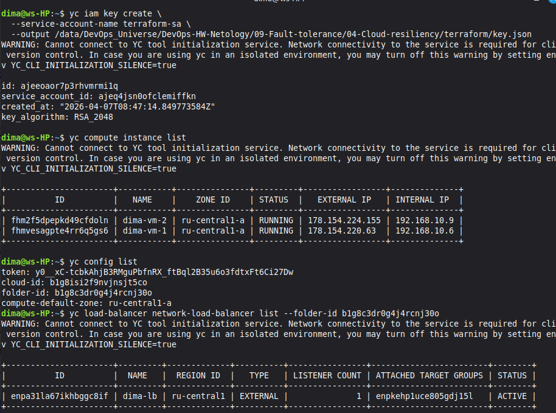

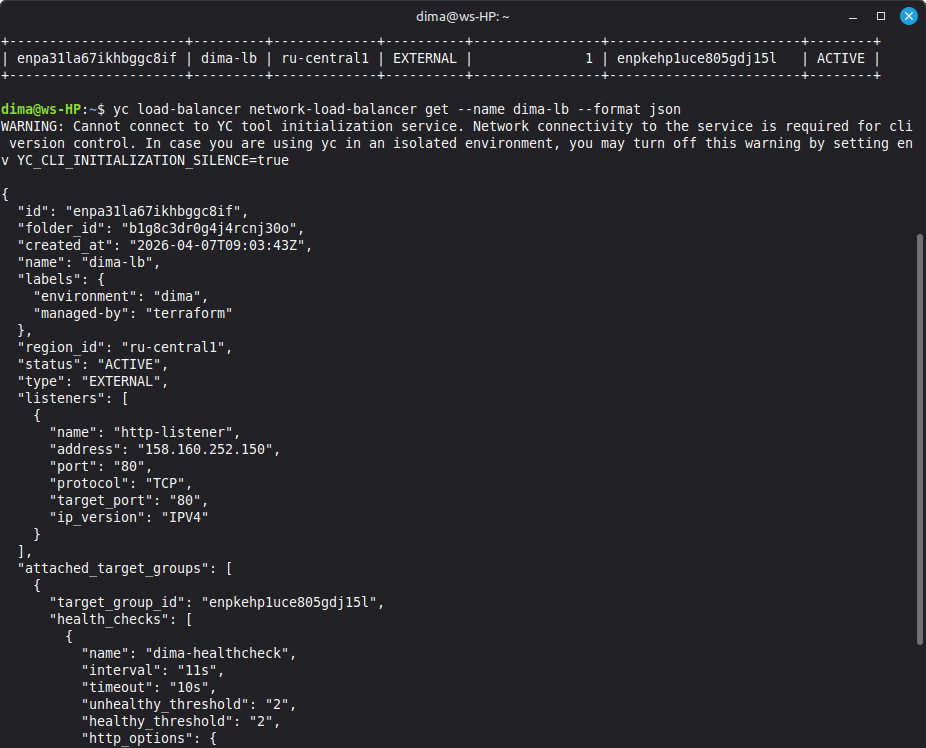

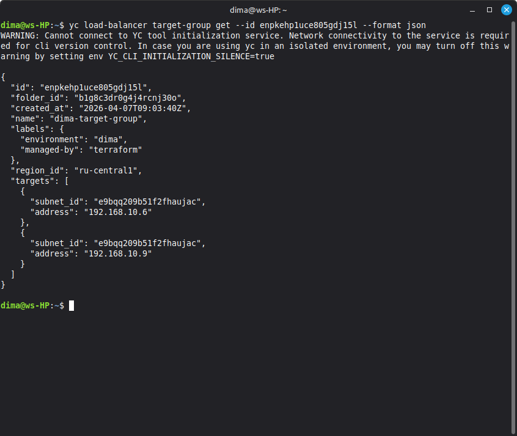


Скриншоты вебинтерфейса

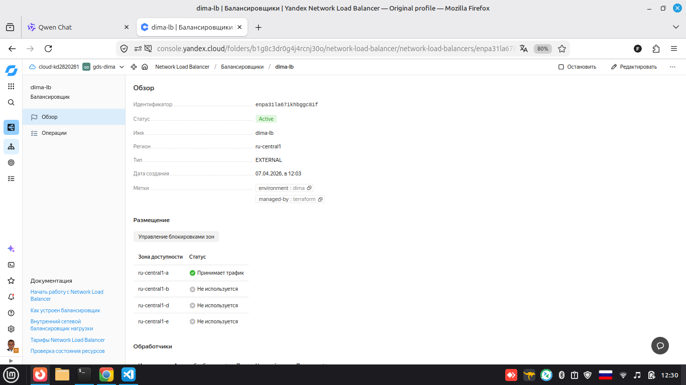

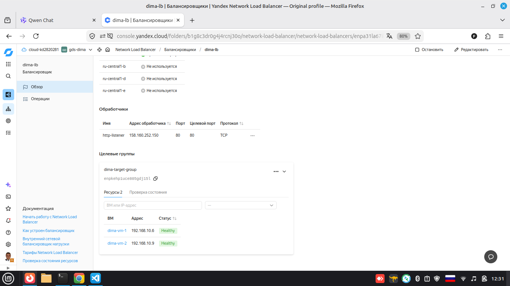

#### 2. Работа балансировщика

ip vm1

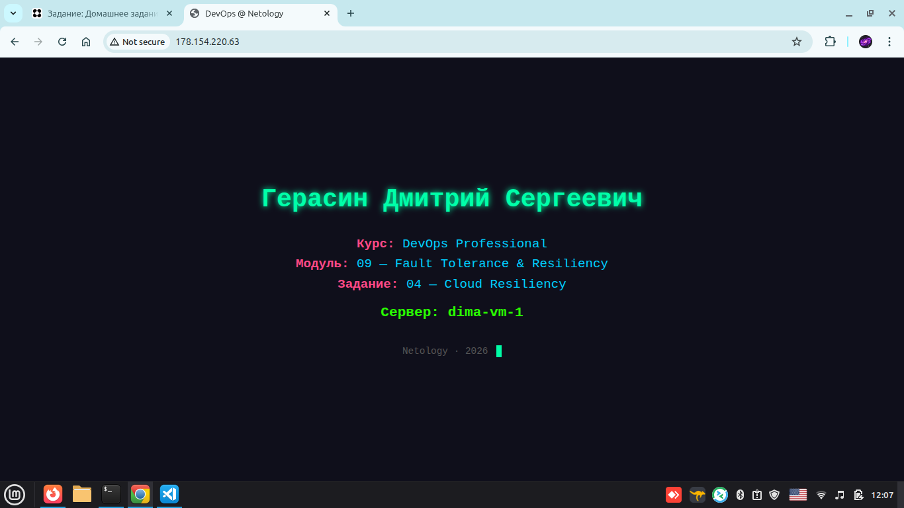

ip-vm2


ip-lb 

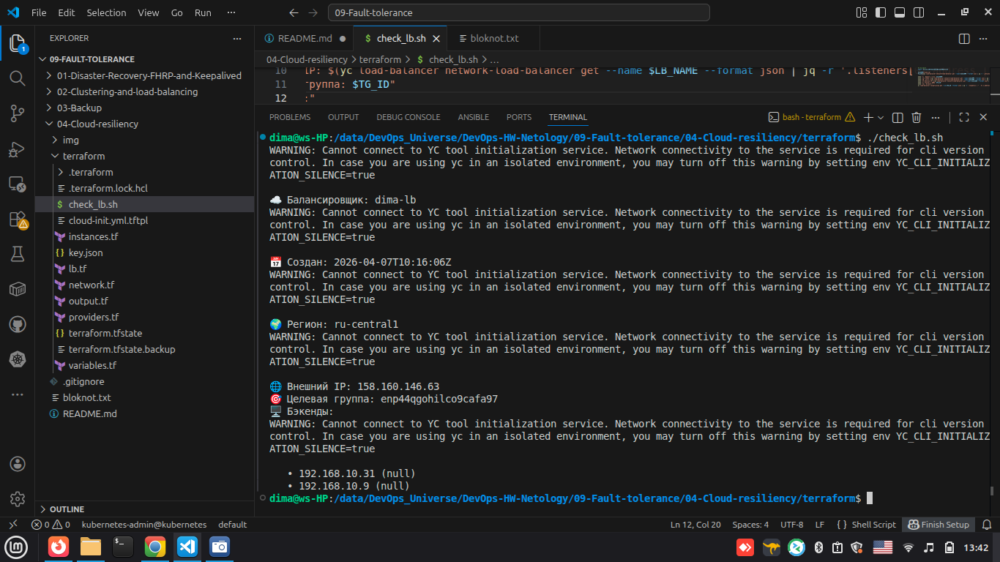

---

## Задание 2

Для выполнения мы создаем группу вм , в чем преимущества 

  - Централизованное управление жизненным циклом ВМ
  - IG автоматически создаёт TG и добавляет/удаляет ВМ при изменениях
  - ВМ распределяются по разным зонам (ru-central1-a/b) → отказоустойчивость при падении одной зоны
  - IG сама генерирует уникальные имена - Без конфликтов, удобно для логов и мониторинга
  
для создания группы машин использовали архитектуру из первого задания, с заменой трех файлов, instances.tf, lb.tf, output.tf

### скриншоты

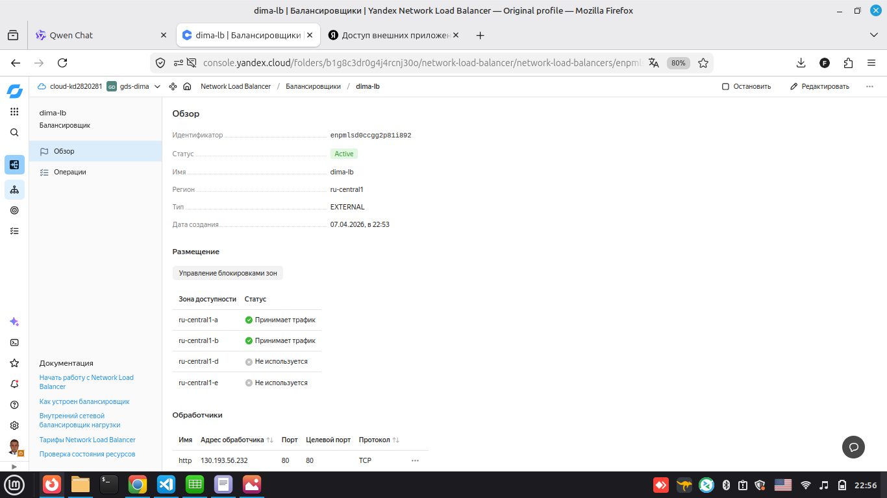
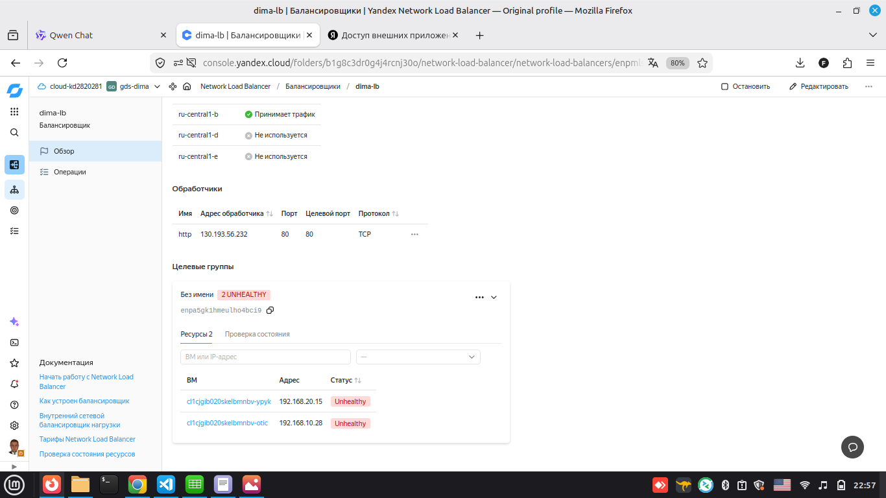

через терминал скриптом

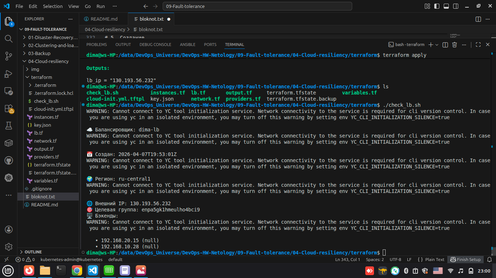

пересоздадим машины с внешними ip для более удобной отладки, 

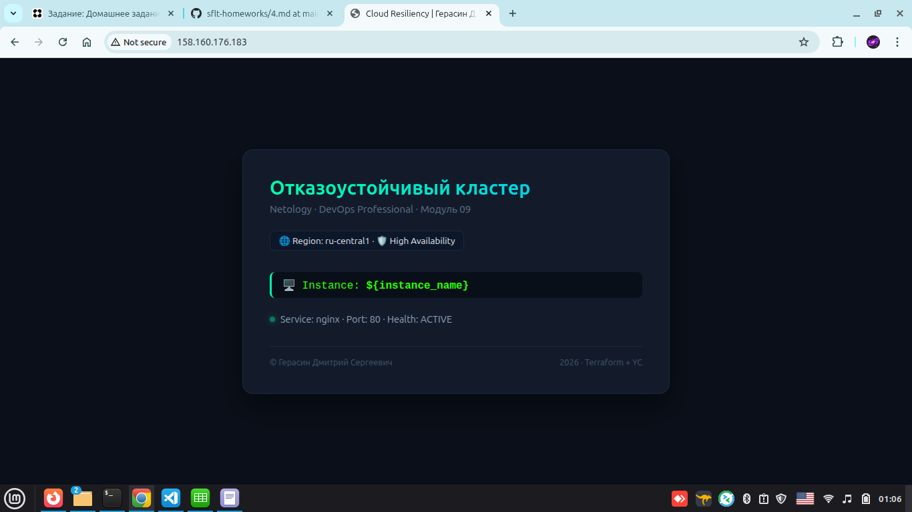

все настроили запустили 
пересоздали машины без внешних ip

консоль список машин


веб страница  адрес балансировщика


---
---
---


### полезные команды при отладке

#### это для совсем новичков но полезно


```bash
terraform state list

terraform console вызов консоли терраформ

yandex_lb_network_load_balancer.nlb.listener

rm -rf .terraform/ .terraform.lock.hcl -очистить кеш

terraform destroy -auto-approve   удаленние 

terraform state show yandex_iam_service_account.ig_sa | grep id   id созданнного терраформ 

 # Чистим облако вручную (CLI)

yc compute instance-group list

yc compute instance-group delete --id
при удалении группы удалятся машины

yc vpc security-group delete --name dima-sg
yc vpc subnet delete --name dima-subnet-a
yc vpc subnet delete --name dima-subnet-b
yc vpc network delete --name dima-network

# затем через терраформ остатки

rm -f terraform.tfstate terraform.tfstate.backup .terraform.lock.hcl
rm -rf .terraform/
```
## не забывайте пересоздавать машины  без внешних ip после отладки.
 


